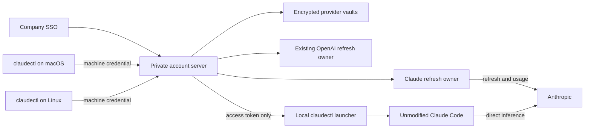

# claudectl account server: research and proposed design

2026-10-02. Status: proposal for Amir; no implementation or deployment approved by
this document. Scope: subscription accounts used by the same person across their
machines, with refresh credentials held only by a private company-SSO account
server.

## Recommendation and feasibility

Extend the codexctl account server with an explicit provider dimension and a Claude
adapter. Reuse company SSO, machine registration, the encrypted vault, authorization,
and deployment. Keep a server account assigned to exactly one company user. Claude
Code continues to run tools locally and send inference directly to Anthropic.

Two constraints prevent claiming parity with codexctl today:

1. **Credential intermediation needs resolution with Anthropic.** Its current
   documentation says developers “may not collect, store, or intermediate Claude.ai
   credentials or session tokens.” It separately allows an end user to sign into
   the unmodified Claude Code binary with their own subscription. A company vault
   collecting those credentials is not established as an exception. Obtain explicit
   confirmation that this proposed own-user arrangement is permitted before building
   or deploying the subscription broker. Company SSO and the absence of an inference
   proxy do not themselves settle this restriction. Team subscriptions must not be
   assumed exempt from the general credential language. [A6]
2. **No documented subscription equivalent of Codex's renewable provider helper
   was found.** `apiKeyHelper` is documented for API/gateway credentials;
   `CLAUDE_CODE_OAUTH_TOKEN` supplies subscription OAuth but stays fixed for the
   session. The documented baseline is token acquisition at launch, then restart
   with a new token on expiry. Updating a credential file during a running session
   is a candidate requiring compatibility evidence, not a promised solution. [A1–A3]

If Anthropic does not permit the vault, retain native per-machine subscription
login, or pursue the officially documented API-key/gateway route as a separate
product decision. API billing does not consume the user's Pro/Max/Team subscription
allowance. The latter can use `apiKeyHelper`, but does not satisfy the requested
subscription-account concept. [A1, A6, A8]

## Evidence and boundaries

Sources were read on 2026-10-02. “Documented” below means Anthropic's published
documentation; “observed” means the isolated local checks below; “proposed” means a
design choice. Existing claudectl behavior and tests are evidence about this
repository, not a guarantee from Anthropic.
The rolling official documentation includes releases newer than the observed
binary; validate each chosen interface against the version actually deployed.

Reviewed claudectl at `7b14c687d9a6a7c87ec1abf28412aa0b986974a5`: `AGENTS.md`,
`CLAUDE.md`, the June spec and implementation plan, the September account-exec
design, and the command, credential, OAuth, usage-cache, and exec implementations.
The June document describes initial behavior; current source additionally guards
aliases sharing the live grant and refuses refresh when live ownership is unknown.
Existing `exec` already supplies an access token through an inherited descriptor in
a private config directory and never refreshes it. [C1–C3]

Reviewed codexctl at `6a290c9bc23f53e5dfcccefa7c8d6e6e21a8631e`: its account-server
guide, `CONTEXT.md`, ADR 0001, and `src/central/` enrollment, transport, vault,
managed server, token owner, native client, migration, and recovery code. This is
an operational reference, not proof that its OpenAI-specific adapter works for
Claude. [X1–X4]

### Safe local observations

Linux binary: Claude Code `2.1.280`, SHA-256
`92f2b4fd05d0bdcf7b9a0d4e0ecef4a1e4b368b290cd8fd07cff9a50013f45a2`.
For each case, a new private temporary working directory and `CLAUDE_CONFIG_DIR`
were used with an allowlisted child environment, updates and nonessential traffic
disabled. The real home variable was retained unchanged. No real credential files
were inspected, no account was logged in, and no inference or refresh request was
intentionally made. All credential-shaped inputs were the same plainly invalid
synthetic sentinel; only selected status fields were recorded. Temporary files
were removed afterward.

| Input to `claude auth status`                                                                  | Exit | Selected result                                            |
| ---------------------------------------------------------------------------------------------- | ---- | ---------------------------------------------------------- |
| Empty isolated config                                                                          | 1    | `loggedIn: false`, `authMethod: none`                      |
| `CLAUDE_CODE_OAUTH_TOKEN`                                                                      | 0    | `authMethod: oauth_token`                                  |
| `settings.json` with `env.CLAUDE_CODE_OAUTH_TOKEN`                                             | 0    | `authMethod: oauth_token`                                  |
| `apiKeyHelper` returning the sentinel                                                          | 0    | `authMethod: api_key_helper`, `apiKeySource: apiKeyHelper` |
| Private `.credentials.json`, `claudeAiOauth.accessToken`, future `expiresAt`, no refresh token | 0    | `authMethod: claude.ai`, synthetic `subscriptionType: max` |
| Inherited pipe named by `CLAUDE_CODE_OAUTH_TOKEN_FILE_DESCRIPTOR`                              | 0    | `authMethod: oauth_token`                                  |

The file case also supplied `user:inference` and `user:profile` scopes. The `max`
label came from that synthetic file; it was not verified against an account. No
other case created `.credentials.json`. The empty case created only config metadata
and its backup. `auth status` reporting a login with an invalid sentinel proves
source selection, **not credential validity, plan entitlement, successful requests,
or in-process reload**. No macOS observation or live token-lifetime experiment was
performed. Inspecting strings in this vendor binary also found
`CLAUDE_CODE_HOST_CREDS_FILE`; that alone establishes no usable contract. [O1]

## 1. How Claude Code receives credentials

| Mechanism                                                      | Subscription OAuth: Pro/Max/Team                                                                      | API/gateway credentials                            | Renewal and conclusion                                                                                                                                                                          |
| -------------------------------------------------------------- | ----------------------------------------------------------------------------------------------------- | -------------------------------------------------- | ----------------------------------------------------------------------------------------------------------------------------------------------------------------------------------------------- |
| `apiKeyHelper` setting                                         | No documented subscription-helper contract; do not equate a bearer header with subscription mode      | Documented; stdout is the credential string        | Default cache is five minutes; `CLAUDE_CODE_API_KEY_HELPER_TTL_MS` changes the interval. Reinvoked on 401/403. Appropriate for the API/gateway alternative, not the selected subscription path. |
| `CLAUDE_CODE_OAUTH_TOKEN`                                      | Documented Claude.ai access-token input; ordinary subscription login supports Pro/Max/Team/Enterprise | Not an API-key input                               | Fixed for the session unless the user runs `/login`; replace and restart after expiry. Preferred documented transport for the bounded-session baseline.                                         |
| Access-only `.credentials.json` managed by claudectl           | Recognized as Claude.ai by the isolated check; normal subscription storage already uses this shape    | A `claudeAiOauth` object is not an API key         | A file writer could replace access token and expiry, but reload/caching/401 behavior remains unproved. Never include a client refresh token. Candidate only.                                    |
| Settings `env` / per-launch `--settings` / process environment | Can supply the OAuth environment input                                                                | Can supply API-key or gateway inputs               | Configuration delivery, not a new refresh protocol. Prefer a child environment over persisting secrets in settings.                                                                             |
| `CLAUDE_CODE_OAUTH_TOKEN_FILE_DESCRIPTOR`                      | Recognized in this binary and used by existing claudectl `exec`                                       | Separate API-key descriptor exists in current code | Better exposure characteristics than environment text, but undocumented in the reviewed public reference. Treat as version-pinned, one-time delivery until stronger evidence exists.            |
| `CLAUDE_CODE_HOST_CREDS_FILE`                                  | Public format, eligibility, and reload semantics not found                                            | Not established here                               | Binary marker is insufficient. Do not build the initial design on it.                                                                                                                           |

Sources: authentication and precedence [A1], settings reference [A2], environment
reference [A3], storage documentation [A5], observation [O1], current exec [C3].

`apiKeyHelper` is executed through `/bin/sh`; documented helper output is sent in
both `X-Api-Key` and `Authorization: Bearer` headers. The helper TTL concerns Claude
Code's cached helper result, not the lifetime Anthropic assigned to a token. A
helper that returns a subscription access token is therefore an unverified
integration, even if a request happens to accept its bearer header. Do not promise
subscription identity, features, or usage displays through that path. [A2]
The documented 401/403 retry applies when the helper supplies the active credential
and `ANTHROPIC_AUTH_TOKEN` is absent. Expired-JWT detection cannot determine the
expiry of opaque Claude OAuth tokens. Desktop and cloud sessions do not call this
helper; this proposal targets local Claude Code CLI launches. [A1, A2]

`claude setup-token` is a distinct option: Anthropic documents a one-year OAuth
token for subscription accounts that can only make model requests. It is not a normal
refreshable login pair, cannot be assumed to read account usage/profile endpoints,
and gives a machine a long-lived bearer credential if distributed to it. Do not
use it to disguise the lack of session renewal; choose short-lived, server-owned
grants for this proposal if authorized. No `setup-token` command was run. [A1]

The environment reference also documents `CLAUDE_CODE_OAUTH_REFRESH_TOKEN` plus
`CLAUDE_CODE_OAUTH_SCOPES` for `claude auth login`. Those would give the machine
refresh authority and must never be distributed by this design. [A3]

### Launch isolation and identity

Authentication precedence matters: cloud-provider and gateway selection can
override subscription auth; bearer/API-key environment inputs and `apiKeyHelper`
also precede the OAuth environment token. A private `CLAUDE_CONFIG_DIR` alone does
not remove project, local, or managed settings. [A1, A4, C3]

Proposed launcher behavior: select the server account explicitly, reject inherited
credential/routing overrides or conflicting settings without printing their values,
and honor managed policy by refusing an incompatible launch. Do not weaken policy.
Use an isolated Claude config with no subscription refresh credentials. Supply the
selected access token only to the Claude child, never as an argument, shell command
substitution, terminal output, receipt field, or persistent settings value. Prefer
the inherited descriptor after version-specific acceptance; retain the documented
environment transport as the compatibility baseline. Neither transport protects a
bearer token from a compromised machine or same-user process inspection.
Refuse bare/simple mode for a subscription launch: it ignores OAuth environment
variables and stored OAuth credentials. [A1, A3]

Keep sessions pinned to the chosen server account. Record only its opaque server
ID, alias, verified account identity, expiry, and non-secret revision in launcher
state. Opaque Claude tokens are not JWTs: validate identity using the provider's
authenticated profile response; never infer it from a token prefix or email alone.
Use account UUID plus organization UUID where returned, and refuse ambiguous or
conflicting migration identity. Session metadata must agree with this identity;
never reuse another account's `oauthAccount` blob. [C1, C2]

A long-running session must not silently switch accounts or replay tool actions.
Warn before the acquired token expires; on expiry/rejection, stop new work and
offer a new launch or explicit resume with a newly acquired token for the same
server account. Persist conversation state separately from disposable credential
state. Cross-launch resume and account identity need acceptance testing. The
first version does not promise seamless sessions beyond access-token expiry.

## 2. Rotation, competing machines, and token lifetime

**Treat Claude refresh tokens as rotating, single-owner credentials.** Existing
claudectl stores a returned replacement refresh token immediately and retains the
old one only when the response omits a replacement. Its design records rotation
observed in Claude Code. Anthropic now documents that parallel sessions on one
machine coordinate renewal and that, before v2.1.211, two sessions renewing with
the same token could revoke the saved login and force every session to log in
again. This is direct evidence of the duplicate-refresh failure mode. It is not a
published guarantee of reuse grace periods or token-family invalidation rules.
[A5, C1, C2]

Copying one refresh grant between two machines bypasses coordination tied to one
machine. One refresh can make the other's saved grant stale; another attempt can
fail or invalidate the login. Local locks cannot coordinate different hosts.
Do not generalize this to independent native logins: this proposal addresses
multiple copies of the **same grant**.

Anthropic's official changelog describes OAuth refreshing eight hours after login.
Use roughly eight hours only as historical planning context, not a promised TTL.
Later changelog entries describe refresh-related behavior roughly once an hour,
reinforcing that a hard-coded eight-hour lifetime would be unsafe.
Use the actual `expires_in` from each token exchange and the derived `expiresAt`
(epoch milliseconds), with a safety margin and clock-skew handling. Missing expiry
means unknown, not unlimited. `setup-token`'s documented one-year lifetime is a
different credential class. No real lifetime or rotation was measured here.
[A1, A7, C2]

### Proposed server refresh rules

Each `(provider, provider account identity)` has at most one refresh owner. Every
token acquisition, usage read needing fresh auth, migration verification, and
login renewal goes through that owner. Serialize refresh and persist the complete
new grant plus expiry before delivery. Scope ownership globally across company
users so a second user cannot import another copy of the same grant/account.

Use a non-secret opaque revision for the full credential state. Two machines
rejecting the same revision cause at most one refresh; a request naming an old
revision receives the newer valid access token. A fresh 401 permits one controlled
retry; a 403 or usage 429 is not proof that refresh is needed. Refresh proactively
within a configured margin for new launches, while acknowledging that this does
not replace the token already held by a running environment-authenticated child.

Use one broker process and durable ownership fences. Do not run two replicas
against copied vaults. On timeout or crash after Anthropic may have rotated a
grant, preserve the journal, quarantine uncertain state, and require diagnosis or
login renewal; never automatically replay an older backup's refresh token. A lost
refresh response cannot be made transactional with local disk. Retain an acquired
replacement grant when later identity verification or activation fails, without
activating an unverified account. [X1, X4]

The existing local rule remains: **never auto-refresh the active local profile**,
nor a saved alias sharing the live grant. Once migration is committed and all
former owners are fenced, the server owns that server account's refresh even while
one or more machines actively use its access token. “Active” on a machine no
longer grants refresh authority. [C1, C2]

## 3. Usage reads and the Claude Code status line

Current claudectl reads `GET https://api.anthropic.com/api/oauth/usage` with an
OAuth bearer and `anthropic-beta: oauth-2025-04-20`. Its profile endpoint is
`https://api.anthropic.com/api/oauth/profile`. These are implementation-observed
subscription endpoints, not a stable public usage API promised by the official
docs reviewed here. API organization usage/cost reporting is a different API and
must not replace subscription allowance reads. [C1, C2, A8]

The account server should perform these reads once per account, using the refresh
owner, and return only authorized usage metadata: general five-hour and seven-day
windows, optional model windows, extra usage, timestamps, freshness, next retry,
and a bounded error classification. Preserve unknown/null fields at the adapter
boundary. Current code also handles model-scoped entries in `limits`, including
Fable; a fixed list of historical model names is insufficient. [C2]

Start with existing claudectl policy: five-minute successful cache, earlier expiry
at a general window reset, serialized usage requests with one-second spacing,
and a 429 cooldown of at least five minutes and the supplied `Retry-After`, growing
to an hour locally unless Anthropic asks for longer. In the shared server, apply
the corresponding cooldown across Claude usage reads so more machines cannot
multiply polling. These are conservative application defaults, not documented
Anthropic quotas. `status --cached` must do no network or refresh work; an explicit
fresh read must still honor cooldowns. Stale/error/absent data displays `Unknown`,
not zero or available capacity. Preserve distinctions between exhausted allowance,
throttled usage reads, credential rejection, and missing scope. [C2, C4]

Claude Code's native status-line command receives JSON on stdin and renders stdout.
Official docs expose `rate_limits.five_hour.used_percentage` and
`rate_limits.seven_day.used_percentage`, with `resets_at` in **epoch seconds**,
after the first API response for Pro/Max. Windows can be absent independently.
Team support for those subscription fields is not promised. Gateway spend limits
are a separate documented case. `context_window.used_percentage` measures the
conversation context, and session cost is not remaining subscription allowance.
[A9]

For a documented OAuth launch, use native subscription fields when present, but
do not promise they appear merely because a helper returned a token. For all plans,
offer an optional claudectl status-line command using a local cache of the account
server's usage response, pinned to the session's server-account ID. A background
poller can update that cache; redraws must not fetch tokens, refresh, or call
Anthropic. On outage it should retain timestamped data and clearly mark it stale.
Preserve an existing user status line unless explicitly configured to replace or
compose it. Illustrative output: `work-main | 5h 24% | 7d 41% | checked 2m ago`;
missing data: `work-main | usage unknown`. Native `/usage` and Team rendering remain
acceptance checks, not assumptions derived from the synthetic tests.

## 4. Shared account server versus a separate service

| Choice                                                                  | Advantages                                                                                                                                                                   | Costs and risks                                                                                                                                                                                                            |
| ----------------------------------------------------------------------- | ---------------------------------------------------------------------------------------------------------------------------------------------------------------------------- | -------------------------------------------------------------------------------------------------------------------------------------------------------------------------------------------------------------------------- |
| Extend codexctl with providers — recommended, conditional on permission | Reuses SSO enrollment, machine approval/revocation, immutable company-user identity, vault, refresh ownership, monitoring, and private deployment; one service for both CLIs | Existing code assumes OpenAI auth and identity in many places; needs versioned schema/protocol migration and provider isolation. Shared outage and security blast radius.                                                  |
| Separate claudectl account server                                       | Independent release cycle, policy boundary, and outage domain; no compatibility change for existing codexctl users                                                           | Duplicates enrollment, authorization, recovery, secrets, alerts, deployment, and machine lifecycle; risks two implementations drifting on refresh safety. Does not solve Anthropic's policy or client-renewal constraints. |

The codexctl implementation is not already provider-neutral: `TokenResponse`
contains `chatgpt_account_id`, its refresh owner talks to Codex App Server RPC,
vault validation inspects OpenAI auth/claims, and catalog/billing logic is specific
to OpenAI. Reuse the infrastructure and ownership model, not those credential
types or the native Codex provider configuration. [X4]



Proposed adapter responsibilities: validate imported identity, perform login
renewal, obtain a usable access token with expiry, reconcile/persist refresh,
classify failures, and read provider usage. Prefer a direct Claude OAuth grant
adapter using the existing claudectl request semantics, if Anthropic permits it;
do not invent a Claude equivalent of Codex App Server RPC. Its token/profile/usage
contracts need their own version-pinned acceptance. [C2, X4]

Use a versioned provider discriminator such as `openai` / `anthropic` in vaults,
catalogs, requests, responses, identity reservations, locks, and metrics. Key alias
lookup by `(company user, provider, alias)` and duplicate detection by
`(provider, validated provider identity)`. Never equate SSO identity with a Claude
account or transfer ownership because an email changes. Preserve ADR 0001's single
company-user ownership; this is not a pool of Team seats shared between coworkers.
[X2, X3]

Existing v1 endpoints must remain OpenAI-only. Introduce explicit provider-aware
endpoints or a negotiated newer protocol; do not let old clients parse a Claude
token as OpenAI auth. Migrate old vault records deterministically to `openai` with
a stopped-writer backup/restore procedure, preserve all ownership reservations,
and require clients to reject unknown providers. Machine enrollment may be shared,
but server-side authorization must bind every response to company user, machine,
provider, and selected account. Decide explicit provider access during enrollment
or an upgrade approval; do not silently broaden an old machine credential's scope.

Token responses should include only access token, expiry, provider/account ID,
revision, and necessary non-secret metadata, with `Cache-Control: no-store`.
Recheck machine/user authorization before delivery. Refresh tokens never appear
in catalog, status, device, or client-token responses. Logs, metrics, receipts,
and error messages must exclude credentials and raw provider response bodies.

Retain the current private HTTPS deployment and single StatefulSet replica with
exclusive storage ownership; keep encryption keys separate from vault storage.
Do not assume the existing deployment's NetworkPolicy is enforced: the reference
guide explicitly records that limitation. Provider-specific timeouts, queues,
and error handling should prevent a Claude failure from blocking healthy OpenAI
accounts. Host administrators with keys and storage remain trusted. Revoking a
machine blocks new acquisitions; it cannot retract an access token already sent
to Anthropic. Availability remains bounded by the shared service and access-token
lifetimes. [X1]

## 5. Migration and multi-machine operation

This is a proposed state machine, not a command available today:

```text
local -> inventoried -> locally fenced -> server verified -> client retired
                       | uncertain completion: remain fenced, reconcile receipt
                       | identity conflict: quarantine, never overwrite another grant
```

1. **Enroll each machine.** Reuse company SSO browser approval and immutable
   issuer/subject identity. Support a printed URL and verification code for Linux
   or SSH without a browser. The machine retains a private device credential and
   non-secret server-account references, never a provider refresh token. [X1]
2. **Stop previous refresh owners everywhere.** Stop Claude sessions, supervisors,
   claudectl status jobs, and other copies of the same grant. Local process checks
   cannot prove a remote machine stopped; require an explicit exclusive-ownership
   declaration and an inventory of known machines. An unreachable old machine
   blocks cutover unless its grant is invalidated through a supported renewal/
   revocation procedure. Never assume copying a newer file revokes an old holder.
3. **Inventory and capture without refresh.** Search saved
   `~/.claudectl/profiles/<alias>/{credentials.json,account.json}`, the active marker,
   macOS `Claude Code-credentials`, `~/.claude/.credentials.json`, and
   `~/.claude.json#oauthAccount`, plus known custom config/run directories and
   backups containing the same grant. Capture rotated live tokens only when live
   identity matches. The macOS file may lag the Keychain; unreadable authoritative
   credentials or ambiguous ownership block migration. Tokens are opaque, so
   preserve metadata and validate it server-side rather than guessing. [C1–C3]
4. **Fence before remote refresh becomes possible.** Under a local auth/mode lock,
   durably record intent and retire refresh-bearing files from normal read paths.
   On macOS run the existing unlock preflight before live credential mutation;
   never accept, pass, store, or log a Keychain password. Stop old binaries too:
   they do not understand new fence markers. If local credential retirement fails,
   do not activate the remote refresh owner. Keep migration recovery material
   inaccessible to ordinary clients and do not let it become a second owner.
5. **Import idempotently and verify.** Upload over authenticated HTTPS with a
   stable migration ID. Reserve identity before starting a refresh owner, validate
   the provider profile, encrypt and durably save the complete grant, then issue a
   durable receipt. Same migration retries reconcile that receipt; they never
   overwrite newer server credentials. Duplicate identity under another company
   user or conflicting alias identity fails closed. A timeout after upload leaves
   local state fenced until the server confirms its outcome. [X1, X4]
6. **Finish retirement.** Retain `account.json` and a non-secret server reference;
   remove refresh-bearing profile files, Keychain/file live copies, inherited
   secret settings, and matching local recovery copies once durable server
   ownership is confirmed. Clear the old active marker when its live credentials
   are retired. Preserve unrelated accounts and unrelated `.claude.json` keys.
   Unlike codexctl's retained private migration backups, this proposal's final
   state permits **no usable client refresh-token backup**. Temporary recovery
   escrow is an explicitly incomplete migration state. Encrypted server backups
   become the recovery source. Snapshots and external backups must be accounted
   for; file deletion alone is not proof that historical bytes are unrecoverable.
7. **Activate separately.** Launch with access-only credentials. Failure after
   import or OAuth preserves the saved server account and offers an activation
   retry; it must not send the refresh token back to the machine. If a subsequent
   login-renewal flow is needed, bind it to the same company user and Claude
   identity, use Anthropic's permitted sign-in flow, and exchange/store the grant
   on the server. Do not present company SSO as Claude authorization. [A6, C1]

Other enrolled machines discover the same provider catalog. A fresh Linux machine
requires no Keychain and no profile copy. An old machine with matching local
credentials must complete retirement before it can activate that server account,
including duplicate aliases; registration alone does not revoke its old grant.
Multiple access-token clients may run simultaneously, sharing the account's actual
subscription limits. Authentication support does not guarantee unlimited concurrent
inference or additional plan capacity.

Keep local mode for unmigrated accounts, with existing profile layout, active
marker, Keychain writes, preflight, capture-before-switch, and refresh rules.
Explicit local switching stays local and never contacts Anthropic. Introduce a
separate server-account launch/selection path rather than silently changing the
meaning of `use <local alias>`. Never fall back from a known server account to a
stale local grant during an outage. Disconnecting a machine removes its device
credential and activation state; it does not restore old refresh credentials.
Returning a migrated account to local ownership would require a separate,
exclusive reverse-migration design.

For Linux, use private directories and files, process locks, the existing private
config/descriptor approach, and headless SSO approval. For macOS, prove that the
new launch path never falls back to an old Keychain grant and that retirement
handles the correct Keychain item and identity. The current Linux observation
does not establish those macOS behaviors.

## Acceptance required before implementation can claim completion

This research did not run live account experiments. After the policy decision,
use only an explicitly admitted dedicated account for any live acceptance:

- Pro/Max/Team entitlement and intended billing through each chosen credential
  path; reject API/gateway/settings overrides rather than charge unexpectedly.
- Two machines acquiring concurrently and crossing real access expiry, proving
  one refresh owner, durable rotation, revocation behavior, and safe restart/resume.
- If seamless renewal is required: access-only file replacement in the same
  running process, cache invalidation, 401 recovery, no refresh attempts by the
  child, and both Linux and macOS behavior. An auth-status check is insufficient.
- Usage scopes, nullable/model limits, 429 cooldowns across machines, native
  Pro/Max status-line fields, Team fallback, and stale/offline display.
- Migration faults at every fence/upload/receipt/retirement boundary, duplicate
  identities, unavailable Keychain, old machine copies, and activation failure
  preserving the server account.
- Existing codexctl compatibility, provider isolation, disabled-user/revoked-machine
  denial, crash recovery, log redaction, and restoration without two refresh owners.

## Sources

**Anthropic primary sources** (live documentation; read 2026-10-02):

- **[A1]** [Authentication: precedence and long-lived tokens](https://code.claude.com/docs/en/authentication).
- **[A2]** [Settings reference: apiKeyHelper](https://code.claude.com/docs/en/settings-reference#apikeyhelper).
- **[A3]** [Environment variables](https://code.claude.com/docs/en/env-vars).
- **[A4]** [Settings scopes and precedence](https://code.claude.com/docs/en/settings)
  and [CLI settings flags](https://code.claude.com/docs/en/cli-reference).
- **[A5]** [Installation troubleshooting: login and authentication](https://code.claude.com/docs/en/troubleshoot-install#not-logged-in-or-token-expired).
- **[A6]** [Legal and compliance: authentication and credential use](https://code.claude.com/docs/en/legal-and-compliance#authentication-and-credential-use).
- **[A7]** [Official Claude Code changelog](https://code.claude.com/docs/en/changelog)
  (v2.1.86 entry describing refresh eight hours after login).
- **[A8]** [LLM gateway configuration](https://code.claude.com/docs/en/llm-gateway)
  and [subscriptions versus gateway billing](https://code.claude.com/docs/en/gateways#subscriptions-and-gateways),
  and [API usage/cost reporting](https://platform.claude.com/docs/en/build-with-claude/usage-cost-api).
- **[A9]** [Custom status line: rate-limit usage](https://code.claude.com/docs/en/statusline#rate-limit-usage).
- **[O1]** Isolated Claude Code 2.1.280 observations, binary hash and method in this
  document's evidence section. These are local observations, not published API guarantees.

**Repository primary sources** (relative claudectl links refer to this PR's base):

- **[C1]** [AGENTS.md](../../../AGENTS.md),
  [original design](2026-06-09-claudectl-design.md), and
  [implementation plan](../plans/2026-06-09-claudectl-v1.md).
- **[C2]** [OAuth](../../../src/oauth.rs), [API](../../../src/api.rs),
  [credential storage](../../../src/auth_store.rs),
  [profiles](../../../src/profile.rs), and [status](../../../src/commands/status.rs).
- **[C3]** [Account-exec design](../../design/2026-09-30-account-exec.md)
  and [exec implementation](../../../src/exec.rs).
- **[C4]** [Usage cache](../../../src/usage_cache.rs) and [README](../../../README.md).
- **[X1]** [codexctl account-server guide](https://github.com/Sawmills/codexctl/blob/6a290c9bc23f53e5dfcccefa7c8d6e6e21a8631e/docs/central-server.md).
- **[X2]** [codexctl vocabulary](https://github.com/Sawmills/codexctl/blob/6a290c9bc23f53e5dfcccefa7c8d6e6e21a8631e/CONTEXT.md).
- **[X3]** [ADR 0001: one company user per server account](https://github.com/Sawmills/codexctl/blob/6a290c9bc23f53e5dfcccefa7c8d6e6e21a8631e/docs/adr/0001-server-account-has-one-company-user.md).
- **[X4]** [codexctl central implementation](https://github.com/Sawmills/codexctl/tree/6a290c9bc23f53e5dfcccefa7c8d6e6e21a8631e/src/central),
  particularly `server.rs`, `vault.rs`, `managed.rs`, `enrollment.rs`, `native.rs`,
  `remote.rs`, `process.rs`, and `relogin/`.

## Decisions for Amir

1. **Permission:** seek explicit Anthropic confirmation for this private
   own-user subscription vault before implementation/deployment; if unavailable,
   retain native subscription login or choose API/gateway billing separately.
2. **Server:** extend the codexctl account server with versioned provider support;
   preserve existing OpenAI clients and add no separate claudectl service initially.
3. **Ownership:** one company user per server account and one server refresh owner;
   no cross-person seat pooling and no client refresh-token copies after migration.
4. **Client experience:** accept launch-time OAuth delivery with restart/resume at
   expiry for the first version, or require a separate proof of seamless renewal
   before approving that version. Do not assume `apiKeyHelper` provides it.
5. **Usage:** add server-cached per-account usage and an optional status-line
   integration; treat native Pro/Max fields as supplemental and Team fields as unproved.
6. **Migration:** require an exclusive, resumable cutover across all old machines,
   including Keychain/file cleanup and local backup retirement; preserve server
   credentials on activation failure and retain local mode for unmigrated accounts.
7. **Availability and scope:** start with the existing private single-replica
   deployment, support macOS and Linux/headless enrollment, and accept bounded
   offline operation until an already-issued access token stops working.
